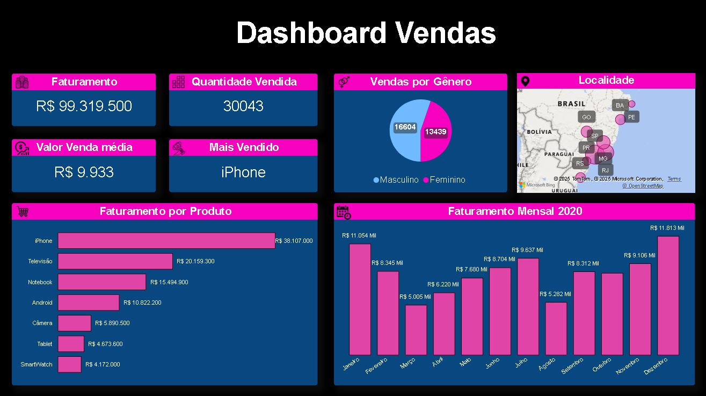

# Sales Dashboard - Power BI

This repository contains a sales dashboard built with Power BI, designed to visualize and analyze sales performance data for the year 2020.

## Overview

The dashboard includes interactive visualizations to help stakeholders understand key sales metrics, product performance, customer distribution, and monthly trends.

### Main KPIs:

-  **Total Revenue:** R$ 99,319,500  
-  **Total Quantity Sold:** 30,043  
-  **Top-Selling Product:** iPhone  
-  **Average Sale Value:** R$ 9,933  

##  Visualizations Included

- **Revenue by Product** – Compare sales figures across different product categories  
- **Monthly Revenue (2020)** – Track sales trends over each month of the year  
- **Sales by Gender** – Pie chart distribution of purchases by gender  
- **Sales by Region** – Map showing geographic distribution of customers  
- **KPIs Cards** – Highlighting key sales metrics  

##  Technologies Used

- [Power BI Desktop](https://powerbi.microsoft.com/)
- DAX (Data Analysis Expressions)
- Bing Maps Integration (Power BI)

##  Screenshot

  

##  Files

- `Proj_Vendas.pbix` – Main Power BI dashboard file  
- `Dashboard_vendas.JPG` – Image preview of the dashboard

##  License

This project is licensed under the [MIT License](LICENSE).

---

Feel free to clone, modify, or use this dashboard for learning and professional purposes. Attribution is appreciated.

##  Author

Bruno Massa  
[GitHub Profile](https://github.com/BrunoBmassa)  
